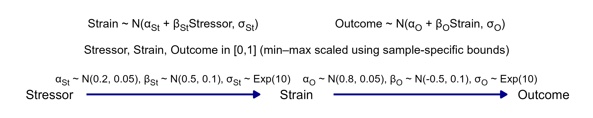
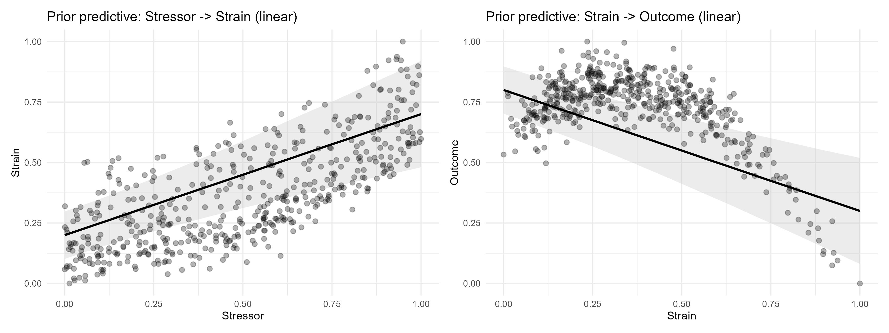
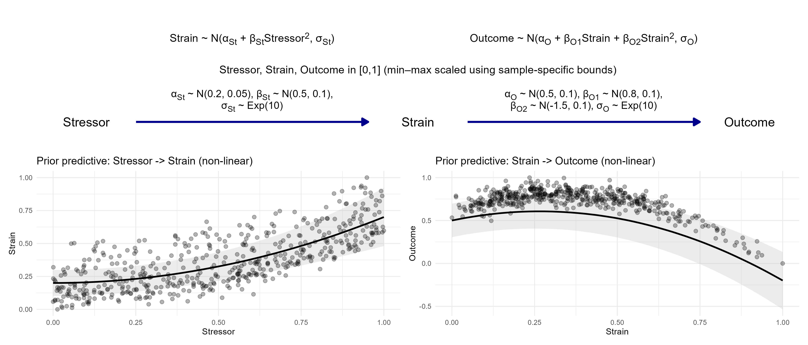
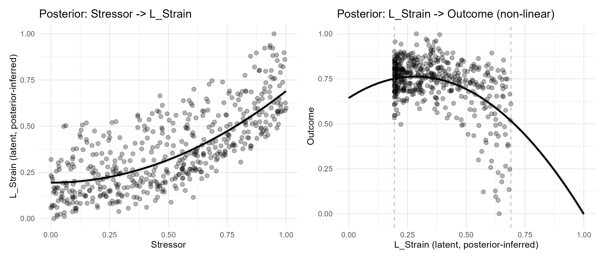
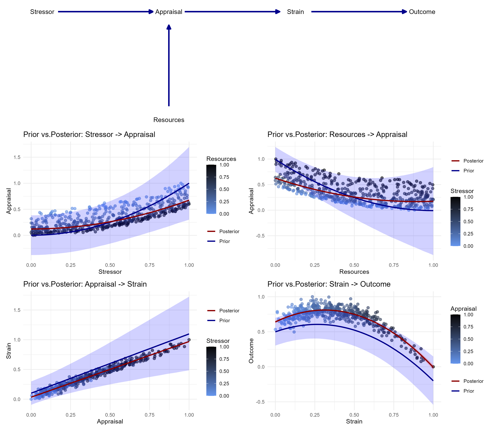

```{r}
#| label: setup
#| include: false
library(tidyverse)
library(igraph)
library(knitr)

# Paths are relative to the "results" folder, which knitr uses as working
# directory when rendering this file; the analysis script and its outputs live
# in the sibling folder "analysis". Keep this folder structure when reproducing.

#To render the manuscript, install the apaquarto extension once in the results folder:
#quarto add wjschne/apaquarto

load("../analysis/bscms-runningsexample.RData")

# The code chunks shown below are pulled directly out of the analysis script, so
# that the manuscript cannot drift from the code that was actually run. In the
# script each displayed block is introduced by a knitr chunk separator of the form
#     ## ---- <label> ----
# and the label is identical to the Quarto chunk label used here. 

script_path <- "../analysis/analysis_BaSCM.R"

knitr::read_chunk(script_path)

```

> “In short, we need understanding. This is, of course, a holy grail of any branch of science - the development of a theory that will enable us to
> predict what will happen in situations we have not even envisioned yet.” (Pearl & Mackenzie, 2018, p. 43)

Despite their central role in science [@popper1959], many psychological theories seem to emerge and disappear without much cumulative progress [@borsboom2021; @eronen2021; @meehl1978]. One striking example is a book listing 83 co-existing theories of behavior change [@eronen2021], with no conclusive answer as to which best explains behavior change. Even when a theory is shown to have major problems explaining a phenomenon, it often continues to be used [@eronen2021]. Some researchers, therefore, compare theories to toothbrushes: nobody wants to use anyone else's [@mischel2008; @robinaugh2021]. Without well-developed theories, however, empirical data collection lacks guidance: physicists, for example, collected 150 exabytes of data for the Higgs particle, but only 0.00001% had to be analyzed because precise theory guided what to inspect [@borsboom2021]. As a result, theory development in psychology often appears non-cumulative. This is also a concern beyond science itself: because psychological research is largely financed from public resources, non-cumulative theorizing may reduce the return on a considerable collective investment. 

In response to this situation, several researchers have argued for stronger formalization of psychological theories, which are still largely verbal [e.g., @borsboom2021; @eronen2021; @meehl1978; @robinaugh2021; @yarkoni2022]. A formal theory is typically expressed in equations rather than words or, as @borsboom2021 puts it, “A formal model captures the principles of the explanatory theory in a set of equations or rules (as implemented in a computer program or simulation)” (p. 761). Theories can be formalized, for example, using mathematical terms [sometimes called mathematical models, see e.g., @smaldino2020], formal logic, or computational programming languages [sometimes called computational models, see e.g., @smaldino2020]. Theory formalization is expected to bring several advantages. It increases precision because equations and formal language reduce ambiguity [@fried2020; @robinaugh2021; @smaldino2017; @vanderleeuw2004]. @fried2020 notes that translating verbal theories into formal ones often requires guessing, precisely because verbal theories are underspecified in many places. Formalization can also capture phenomena that are difficult to express in words [@vanderleeuw2004], and it supports transparent theorizing [@guest2021]. In this sense, formal theories may serve as a common language [@robinaugh2021], making shared assumptions, overlaps, and contradictions visible that remain masked in verbal theories [@smaldino2016a], which is why they are viewed as conducive to collaboration [@robinaugh2021] and pluridisciplinary research [@vanderleeuw2004].

# Formal Theories

## Heterogeneity of Current Theory Formalization
Overall, theory formalization is expected to offer many advantages, especially for improving the cumulative nature of psychological theory development. This promise, however, has not yet been realized: current approaches differ substantially in their methodological foundations, in what they count as a formal theory, and in the statistical frameworks they employ, often without clear integration. This is not surprising given how young the field still is, but it undermines one of the main reasons for formalization in the first place. The hope that formal language could function as a shared and precise representational medium [@robinaugh2021; @smaldino2016a; @vanderleeuw2004] depends on interoperability across approaches: if two research groups formalize the same phenomenon in different formal languages and with different commitments about what a formal theory is and how it relates to data, their models can neither be compared nor combined nor successively refined. Without such integration, formal theories may simply replicate the current state of psychology, with many disconnected theories of the same phenomenon now in formal rather than verbal form. Cumulative progress, therefore, presupposes at least a partially shared methodological basis.

This problem may be even more serious for formal theories than for verbal ones. Formal models often require specialized expertise and can therefore appear less accessible [@robinaugh2021], which may limit their adoption, critique, and refinement. Consistent with this concern, there are few clear examples of formal theories being meaningfully refined by independent research groups. This aligns with @vanlissa2025, who note that methods for specifying, sharing, and iteratively improving theories remain underdeveloped. At the same time, the need for greater integration is increasingly recognized. @glockner2025, for example, note that several partially overlapping methods for theory specification coexist without clear guidance for when to use or combine them, and that researchers face substantial barriers in practice. Recent work therefore calls for systematic comparisons, explicit methodological trade-offs, and structured consensus-building to develop more coherent and widely accepted approaches [@glockner2025]. Related efforts include a consensus-building process on formal theory terminology (https://osf.io/bqd4m/overview), the development of the FAIR standard for theory formalization [@vanlissa2025], and the development of a models database [@nak2025].

## Traditional Statistical Models vs. Formal Theories
A central issue in this debate is the relationship between statistical models and formal theories. Psychology has a long tradition of fitting statistical models to data, most often still simple linear models [@blanca2018], which are unlikely to capture the complexity of the phenomenon to be explained. Machine learning and other data-driven approaches are also becoming more common. In practice, fitting statistical models often remains the main way theory is indirectly informed by data.
The literature, however, differs on whether statistical models can be equated with formal theories. Several authors warn against the conflation: psychologists regularly interpret statistical models as theoretical ones [@fried2020a; cf. also @fried2020], and formal models should not be confused with statistical data models such as ANOVA or regression [@borsboom2021; cf. also @robinaugh2019]. @fried2020a further argues that model fit alone reveals little about the underlying data-generating mechanism because different statistical models can be observationally equivalent. Temporal data can rule out some such models, and interventions may distinguish models that look identical under purely observational data [@fried2020a].
At the same time, @frankenhuis2023 note that statistical models can sometimes test predictions from formal models and help calibrate model parameters against empirical data. This preserves the distinction between statistical models and formal theories. In a related argument, @smaldino2020 observes that, except in rare cases, applying inferential statistics to relationships produced by a formal simulation model is often unnecessary. As he notes, once the formal model itself defines the data-generating process, one can “simply run enough simulations to obtain arbitrarily precise estimates” [@smaldino2020, p. 214]. Accordingly, current theory formalizations differ substantially in how closely they tie theory to data, ranging from treating a fitted SEM as the theory itself to simulating from a system of equations without any empirical comparison; we return to this distinction below [@haslbeck2022]. Statistical models should therefore not automatically be treated as theories themselves. Later in this article, we aim to show how the proposed formalization framework based on Bayesian fully-specified structural causal models (BaSCMs) can serve as a bridge between statistical models and formal theories. 

## Characteristics of Formal Theories
The heterogeneity of current theory formalization approaches goes further towards a more basic question: what should formal theories have in common if they are to support cumulative theorizing? Beyond the general idea that they are expressed in mathematically precise rules, the literature mainly discusses three characteristics, which we return to when presenting our formalization framework below. The first is generativity. @robinaugh2021 argue that explanations should be simulatable, and @borsboom2021 and @vandongen2025 emphasize that formal models are typically used to construct simulations clarifying what should be expected if a theory were true. @fried2020 stresses that precisely this possibility of simulating theory-implied data and comparing it with observed data is what verbal theories lack. The second is causality. @pearl2018 emphasize that a model of an underlying causal process is often referred to as a theory, @robinaugh2021 report that formalizing a theory required them to think carefully about the nature of each causal effect it implies, and @grosz2020 argue that cumulative psychological science requires the iterative investigation and refinement of causal mechanisms across studies. @eronen2021 note that psychology might also develop noncausal theories based on abstract regularities extracted from empirical phenomena, but leave open whether these could explain in the same sense as causal ones. The third and most contested characteristic is whether a measurement model is a necessary part of a formal theory. @robinaugh2021 demand that a formalization specify not only which variables are assessed but also which assumptions are made about how these variables relate to components of the real world, that is, the function linking the components of the target system to the empirically measured variables; most current formalizations, however, contain no measurement model at all. These three features are specific to formal theories and should be distinguished from broader criteria for evaluating theories in general.

## Aim of This Work
To support more cumulative theory development, we aim to integrate several largely disconnected streams of literature into a coherent and accessible framework for formal theory building. We show how the framework reflects the core characteristics of formal theories discussed in the literature and how it is consistent with several theory formalization methodologies. Its main contribution is that theoretical modeling and empirical updating are integrated within one approach: researchers can work directly with the theoretical model, generate data from it, and update it in light of empirical evidence. A further strength is that the framework is complete in the sense that it covers the whole path from specifying a theory to deriving what can be tested: because the formalization is generative and causal, it implies both quantitative predictions and conditional independence relations that can be confronted with data, and it shows where competing formalizations differ and where particularly informative, potentially crucial tests can therefore be located. Although the proposed framework is situated more in the highly formalized end of the spectrum of theory formalization methods, its elements can also be used for lighter forms of formalization, for example, to translate a verbal theory into a directed acyclic graph without specifying the functional form or parameters of the variable relationships.

Clearly, this framework will not always be applicable, but at least widely; this is what we aim to show in the following. Specifically, the proposed approach brings together (i) developments in statistical modeling based on (Bayesian) structural causal models [@mcelreath2020; @pearl2009; @pearl2009a], (ii) the longer tradition of cognitive modeling [see, e.g., @lee2013; @vanpaemel2012], and (iii) perspectives from complexity science on causal loop diagrams and system dynamics [@crielaard2022], while remaining consistent with (iv) the literature on theory formalization methodologies and characteristics.

# BaSCM
We define a BaSCM as a fully-specified structural causal model of the phenomenon to be explained, that is, a model whose causal structure, structural functions, parameter priors, variable scaling decisions, and stochastic components are all explicitly specified and whose parameters are estimated or updated within a Bayesian framework. Causality is part of this definition rather than an optional addition. Of the available statistical frameworks for causal inference, the BaSCM framework adopts structural causal models based on directed acyclic graphs (DAGs) rather than the potential outcomes framework [@rubin1974; @rosenbaum1983]. In such a graph, nodes represent the variables of the theory and directed edges represent hypothesized causal relationships, whereas an edge in an undirected network model merely indicates statistical dependence [@pearl2018]. Familiar psychological examples of such causal structures include mediation and moderation. An important distinction, however, is whether a theory merely contains causal assumptions or whether these assumptions are also tested, because relationships that are interpreted causally remain weakly corroborated if they are never systematically evaluated against data. Such evaluation is not restricted to experimental designs and can, under appropriate assumptions, also be conducted with observational data [@bollen2013]. Causal assumptions further differ in strength: strong assumptions concern specific values, as when a missing path in a structural causal model sets the coefficient of that effect to zero, whereas weak assumptions merely exclude some parameter values while permitting others [@bollen2013]. In statistical terminology, a *parameter* is a numerical characteristic of a population or of a model [@everitt2010]. Accessible introductions to structural causal models are provided by @pearl2009 and @pearl2009a, by @mcelreath2020 for Bayesian causal modeling, and by @lee2013 for modeling in cognitive psychology. In this work, we expect some prior exposure to these concepts and present our theory formalization framework from an applied point of view using a running example.

A BaSCM is fully specified once a structural function is given for every node of the graph, which is what allows any counterfactual query to be answered [@pearl2018], that is, questions about what would have happened if one of the variables had taken a different value, assuming the graph is an appropriate representation of the world. This includes, for example, how much strain a specific person would have experienced if the stressor had been absent. These functions are not necessarily linear, and discrete as well as continuous variables can be used [@pearl2018]; this flexibility is essential when formalizing psychological theories, which often posit qualitatively different types of variables and mechanisms. Acyclicity requires some care whenever a theory posits feedback. Feedback loops are common in psychology, from learning and habit formation to the development of substance dependency, and they operate on very different time scales. Such loops can be represented within the framework as long as they are unfolded in time. To illustrate with the running example introduced below, a stressor may have a causal effect on an outcome, while the outcome in turn influences subsequent perceived stressors; this can be captured within a DAG by introducing temporal indexing, so that Stressor$_1$ affects Outcome$_1$, which in turn affects a later stressor, Stressor$_2$ [cf. @rohrer2018]. Feedback loops seem to often reflect coarse-grained descriptions of processes that become acyclic at a finer temporal resolution. What differs between fast and slow loops is, therefore, mainly the resolution at which the variables have to be indexed, not whether the loop can be formalized at all. If feedback is essential and cannot be represented in an acyclic form, a formal theory can still be constructed, but standard causal inference techniques based on DAGs can no longer be directly applied, so that this component of our formalization framework is no longer available (see, however, @bongers2022 and @mooij2013 for ongoing work in this area). The resulting formal theory may then be termed a system dynamics model, in which variables are typically classified as constants (elements with approximately fixed values), stocks (quantities accumulating over time), and auxiliaries (dynamic variables computed from other variables at a given time point) [@crielaard2022].

Besides the causal structure, the Bayesian component of the model carries theoretical content. The prior distributions are part of the formalization itself: following a growing literature in cognitive psychology, priors should not be treated as technical necessities but as integral parts of theory formalization [@vanpaemel2010; @vanpaemel2012].^[We are grateful to Prof. Dr. Daniel Heck for pointing us to the literature on this topic.] They encode which parameter values are plausible, implausible, or theoretically impossible, so that formalizing a theory means not only specifying structural relationships but also constraining the parameter space in theoretically meaningful ways. This practice increases what @popper1959 called the empirical content of a theory, that is, the range of possible observations that the theory excludes, while often reducing unnecessary model flexibility [@vanpaemel2012]. Bayesian estimation further treats parameters as uncertain quantities rather than fixed values: instead of focusing solely on point estimates such as the maximum a posteriori (MAP), the full posterior distribution captures the range and plausibility of parameter values, whereas a single estimate would assume that the likelihood of the data is zero everywhere else, which is rarely the case [@crielaard2022]. Representing parameters as distributions therefore allows uncertainty to propagate through the model, yielding predictions that reflect both theoretical assumptions and empirical evidence. Because all functional forms are specified and all parameters have priors, data can readily be simulated from the theory alone. This helps to close the gap between traditional statistical models and theoretical models: the resulting formalization could be seen as a statistical model, but it is at the same time more than that, because it structurally encodes all theoretical assumptions about the phenomenon to be explained and, unlike a statistical model, does not require data at all. The implications of the theory can be explored in data simulated from it.

Where empirical data are available, confronting the theory with them becomes a formal operation. The prior distributions represent the theory before the data are seen, the posterior distributions represent the theory after updating, and the divergence between the two quantifies how much, and precisely where, the theoretical commitments had to be revised. A theory that makes risky quantitative predictions [@meehl1978; @meehl1990b] and survives this confrontation with little change has passed an informative test, whereas large divergences localize those parts of the theory that require revision. Because the posterior of one study can serve as the prior of the next, theory refinement across studies becomes a formal updating operation rather than an informal synthesis of findings. A practical benefit of this setup is that it provides an explicit route from a verbal theory to a formal one. Formalizing a verbal theory here requires a small and fixed set of decisions: which variables the theory refers to, which of them are causally connected and in which direction, which functional form each connection takes, which parameter values the theory considers plausible, and on which scale the variables are measured. Working through this list makes the places where the verbal theory is silent immediately visible, which is exactly where translation would otherwise require guessing [@fried2020]. The decisions can moreover be taken step by step, so that a verbal theory can first be represented as a causal graph and later be equipped with functional forms and parameter priors. Researchers can thus stop at the level of commitment their theoretical knowledge supports and continue later, instead of having to formalize everything at once.

## Embedding in Formal Theory Construction Methodologies
The framework can be embedded naturally in existing theory construction methodologies, which differ in emphasis but share the goal of making theories precise enough to generate expectations that can be compared with empirical phenomena [@borsboom2021; @borsboom2024; @haslbeck2022; @vandongen2025]. The Theory Construction Methodology (TCM) of @borsboom2021 conceptualizes theory construction as a sequence of stages: identifying empirical phenomena, developing a prototheory, formalizing theory and phenomena, checking explanatory adequacy, and evaluating the resulting theory. BaSCMs primarily address the stages following the prototheory, for which they provide a concrete representation and which they open to both simulation-based evaluation and evaluation against empirical data. @haslbeck2022 focus on the relationship between formal theories and data models and distinguish treating data models as formal theories, using data models to infer formal theories, and comparing empirical with theory-implied data models in order to refine a theory; they favor the third option and formalize it as abductive formal theory construction (AFTC). @borsboom2024 call the first direct inference and the evaluation of a theory through its ability to account for empirical phenomena indirect inference. @vandongen2025 further specify that a theory explains a phenomenon to the extent that a formal model of it produces the statistical pattern representing that phenomenon.

A related tradition comes from complexity science, where a causal loop diagram (CLD) serving as a prototheory is extended into an annotated causal loop diagram (aCLD) documenting intermediary variables, functional relationships, sources of evidence, and sources of uncertainty, and is finally translated into a simulatable system dynamics model [@crielaard2022; @waaijers2025]. The BaSCM approach corresponds to the later steps of this workflow, with the difference that the final model is not a potentially cyclic system dynamics model but a generative, acyclic structural causal model; as discussed above, this constrains how feedback has to be represented, but it is also what makes causal inference possible.

## Overview of the Features of the Framework
In the following sections, we introduce our running example and demonstrate how a psychological theory can be translated into a BaSCM theory formalization. In doing so, we show how the framework bridges statistical and theoretical models, how it fulfills the characteristics of formal theories discussed above, and which further features make it useful in practice. First, a BaSCM has a *graphical representation* that displays the causal structure together with the equations, the parameter priors, and the scaling decisions; because this is a full description of the formal theory, the theory is transportable across research groups in graphical form. Second, it is *generative*: because all functional forms and priors are specified, data can be simulated from the theory alone. Third, it makes *measurement and variable scaling* explicit, which is what makes parameter values comparable across studies. Fourth, it supports *functional refinement*, that is, the successive replacement of coarse (often linear) relationships by more precisely derived, possibly nonlinear ones. Fifth, it can accommodate *latent variables* that are not directly observed. Sixth, it is *modular*, so that individual mechanisms can be replaced or elaborated without respecifying the entire theory. Seventh, it is *causal*, which means that the causal assumptions of the theory imply conditional independencies that can be tested against data. Eighth, it allows the *empirical updating* of the formalized theory, which is a crucial feature from our point of view.

## Introduction of the Running Example: The Stressor–Strain–Outcome Theory 
As a running example, we consider a formalized version of the stressor–strain–outcome (SSO) theory [@koeske1993], which posits that environmental stressors cause strain, with strain then impacting the outcome. This theory builds on foundational stress theory, distinguishing between external demands (stressors) and internal responses (strain/stress) [cf. @selye1978]. In the section on modularity, we later substitute the path from stressor to strain by including resources and the appraisal as elements of the transactional stress model [@lazarus1984]. Note that resources and appraisal are already part of the data-generating process described next, that is, of the simulated “reality” that the formalized theory is meant to capture; they are, however, deliberately absent from the first and simplest formalization of the theory.

Throughout the article, we show the corresponding R code in short chunks. These chunks are not meant to be read as a complete analysis script but as a template on how to use each of the BaSCM features for one’s own theory formalization. They are extracted automatically from the analysis script, so that the code shown here is identical to the code that produced the reported results. The complete and executable scripts are available at <https://github.com/pskaschel/BaSCMs>.

### Data-Generating Process
The data-generating process (DGP) serves as our image of actual reality: it produces a data set of $N = 500$ observations on the phenomenon that takes the role of a collected empirical data set in real research, and everything that follows, that is, the formalized theory, its refinement, and its updating, is developed as if the DGP were unknown. The DGP assumes a nonlinear appraisal mechanism in which stressors increase appraisal in an accelerating (quadratic) fashion, while resources exert a nonlinear buffering effect. Appraisal translates linearly into strain, such that higher appraisal leads to proportionally higher strain. The relationship between strain and outcome follows an inverted U-shape, with moderate levels of strain associated with the most positive outcomes and both low and high levels linked to more negative outcomes. The error terms were chosen so that the generated observations show reasonable variance while still displaying a clear pattern, and the process is kept deliberately simple. It assumes the same parameters for all subjects with variation due to the stochastic error term. Subjects also differ in their baseline level of the experienced stressor and their resources. It also assumes that the intraindividual process of experiencing a stressor, its appraisal etc., is appropriately covered by the stationary variables. More details on intraindividual and interindividual phenomena in the context of theory formalization can be found in @borsboom2024. 

$$
\begin{aligned}
Stressor_i &\sim \mathcal{U}(0,1) \\
Resources_i &\sim \mathcal{U}(0,1) \\
\\
Appraisal_i &= 0.6 + Stressor_i^2 - 1.8 \cdot Resources_i + Resources_i^2 + \varepsilon^{(1)}_i \\
Strain_i &= 0.0833 + 0.9 \cdot Appraisal_i + \varepsilon^{(2)}_i \\
Outcome_i &= 0.5 + 0.4 \cdot Strain_i - 0.6 \cdot Strain_i^2 + \varepsilon^{(3)}_i \\
\\
\varepsilon^{(1)}_i &\sim \mathcal{N}(0, \frac{7}{200}) \\
\varepsilon^{(2)}_i,\ \varepsilon^{(3)}_i &\sim \mathcal{N}\left(0, \frac{0.4}{6}\right)
\end{aligned}
$$

Throughout this article, the second argument of a normal distribution $\mathcal{N}(\mu, \sigma)$ denotes the standard deviation rather than the variance, following the convention of *brms*. The resulting variables were then min–max scaled (rescaling to [0, 1]) to make the variable scales comparable: $x^{*} = \frac{x - \min(x)}{\max(x) - \min(x)}$. This transformation also obscures the parameters of the data-generating process to some extent, which makes the exercise more realistic. Importantly, the formalized theory designed in the next steps is based on theoretical knowledge. This is in contrast to statistical model fitting, in which an often weakly structurally specified statistical model is fit on empirical data. Instead, the aim is to design a theory with a structure and relationships based on theoretical knowledge and to, then, refine it by comparing it to the "empirical data" (which is, in our illustrative case, the data generated by the DGP from above). 

### Theory Formalization
We formalize the Stressor-Strain-Outcome (SSO) theory by @koeske1993. The formalization assumes that all variables are min-max scaled to the range [0, 1] and parameter values are defined in the equations based on this. This is already a decision about measurement: the parameter values specified below are only interpretable in the context of this transformed [0, 1]-scale, so that applying the theory to variables measured on a different scale requires transforming them accordingly. We return to this point in the section on measurements and variable scaling. For all variables and parameters, we assume normal distributions for simplicity, even though variables with a [0, 1] range are not normally distributed. Without this simplification, the presentation would become much less accessible in this applied introduction. 
We begin with the simplest formalization of this theory; the functional relationships will be elaborated later in this article. For this first formalization, we assume causal pathways from a stressor in the environment to a person's strain and a causal effect of this strain on the positivity of the outcome. We formalize that the causal effect from stressor to strain is linear and clearly positive: $\beta_{St} \sim \mathcal{N}(0.5,\, 0.1)$ (see @fig-sso). Such a prior distribution is a statement about the parameter itself and not about the observations. Its mean expresses the value that the theory considers most plausible, here an increase of half a unit of strain per unit increase of the stressor, with both variables measured on the [0, 1] scale. Its standard deviation expresses how strongly the theory commits to this value: a value of 0.1 means that the theory regards effects of roughly between 0.3 and 0.7 as plausible and effects outside this range as increasingly implausible. Narrower priors thus encode stronger theoretical claims, and the units in which this variation is expressed are the units of the parameter itself, in this case units of strain per unit of stressor. We further assume that baseline levels of strain are low but not zero in the absence of stressors, which is reflected in a small intercept: $\alpha_{St} \sim \mathcal{N}(0.2,\, 0.05)$. Residual variation in strain that is not explained by the stressor is captured by a stochastic disturbance term with standard deviation $\sigma_{St} \sim \mathrm{Exp}(10)$. This distribution has an expected value of 0.1, reflecting relatively small but non-negligible unexplained variability. More generally, the specific numbers in these priors are not arbitrary but follow from theoretical considerations about the phenomenon that are then translated onto the chosen measurement scale: a verbal claim such as "stressors strongly increase strain" already commits to a range of parameter values as soon as the scale of the variables is fixed.

```{r}
#| label: fig-sso
#| fig-cap: "BaSCM Representation of the Formal Stressor-Strain-Outcome Theory"
#| apa-note: "Arrows indicate causal relationships, equations the functional equations between the variables as well as the parameter value range."
#| apa-twocolumn: true
#| out-width: 100%


```

Strain is then assumed to causally affect the outcome. We formalize this relationship as negative, such that increases in strain are associated with a deterioration of the positivity of the outcome variable. This effect is specified as $\beta_{O} \sim \mathcal{N}(-0.5,\, 0.1)$, that is, of comparable magnitude to the stressor-strain link but opposite in sign. The baseline level of the outcome, independent of strain, is assumed to be positive, as reflected in $\alpha_{O} \sim \mathcal{N}(0.8,\, 0.05)$. As before, unexplained variability is modeled via a disturbance term with $\sigma_{O} \sim \mathrm{Exp}(10)$. Together, these assumptions define a fully specified generative model in which the stressor influences strain, which in turn influences the outcome, with uncertainty represented through parameter distributions and stochastic disturbances.

## Graphical BaSCM representation
Theories formalized in accordance with the proposed framework can be visually represented. This representation (see @fig-sso) specifies the theory completely, so that the theory is transportable and other research groups can apply it without further communication with the original authors. This is a precondition for the cumulative theory building described above, which is considered a core advantage of formal theories [see e.g. @robinaugh2021]. The BaSCM representation (@fig-sso) is based on the causal DAG, with the functional relationships of the paths, all parameter priors, and the scaling of the variables annotated. It is deliberately layered, which makes it a fairly general format: removing the annotations returns a plain causal DAG as used in causal inference, and adding information on uncertainty, on causal links known to be absent, and on sources of evidence approaches the annotated causal loop diagram (aCLD) proposed by @crielaard2022, which differs mainly in allowing loops. One could also add plots of the functional relationships to the edges to improve comprehensibility. Cumulative and cooperative theorizing is further fostered when different research groups use the same abstract symbols for the same theory formalization across studies. 

## Generative Feature for Data Simulation
Theories formalized in the BaSCM framework are fully specified in the sense that all functional relationships and parameter priors are explicitly defined. As a consequence, they are generative: data can be simulated directly from the theory, which is why such a formalization may also be called a generative or a computational model. This is where the framework differs most clearly from treating a fitted statistical model as a theory. A structural equation model (SEM), for instance, is not by itself generative. It specifies structural relations among variables, but simulating data from it additionally requires parameter values, distributional forms for the exogenous variables and the error terms, and a commitment to the functional form of each relationship, which is often only partially specified and implicitly determined by the chosen estimation approach or modeling assumptions. The same holds for conceptual models more generally: identifying the components of a system and their relations does not yet determine how the system would behave under given circumstances [@crielaard2022]. Because a BaSCM leaves none of these elements implicit, the definition of the parameter space is part of the formal theory itself (see the priors in @fig-sso), and different regions of that space can imply substantially different predictions. Simulating from the theory further allows researchers to examine how uncertainty in the assumptions propagates to uncertainty in the predictions [see @crielaard2022 for an insightful discussion of sensitivity analyses of this kind].

### Running Example
All analyses were conducted in R [@rcoreteam2021]. The formal theory can be implemented using the R package *brms* [@burkner2017]. For data processing, we use the R *tidyverse* [@wickham2019]. Conditional independence assumptions (see section on causality) are assessed using the package *dagitty* [@textor2016]. In brms, each causal path is specified as a structural equation via `bf()`. The parameter priors are defined as part of the theory, and setting `sample_prior = "only"` in `brm()` samples exclusively from the priors, i.e., simulates data from the formal theory without any empirical updating:

```{r}
#| label: code-sso-linear
#| echo: true
#| eval: false
```

All code examples use `sso_sim`, the "reality" generated by the DGP described above. The data set contains the five SSO variables on the unit interval, plus precomputed squared terms and a constant column of ones for explicit intercept specification. To compare the slopes from the formal theory against the data, the individual observations generated by the DGP, which take the role of empirical data here, are also shown in @fig-sso-lin-fit. In this figure, we see that the theoretically derived linear relationships in the formal theory are consistent with the overall direction in the data but the precise relationships in the data (non-linearity) are not well captured. This comparison is possible because the formalized theory produces data before any empirical information enters the model. 

```{r}
#| label: fig-sso-lin-fit
#| fig-cap: "Data Simulation: Linear Formal Stressor-Strain-Outcome Theory"
#| apa-note: "Points represent observations from the data-generating process. Lines indicate prior predictive expectations under the linear formalization. Shaded areas reflect uncertainty induced by the priors."
#| apa-twocolumn: true
#| out-width: 100%


```

## Measurements and Variable Scaling
Whether a formal theory must include a measurement model is, as noted above, the most contested of the three characteristics, and most current theory formalizations do not include one. A related, and in a sense stronger, point is made by @frischkorn2026: whether an observed indicator validly measures an attribute of a process cannot be established by psychometric means alone, but only relative to an explicit theory of how the processes generate the observations. Measurement thus sits on top of a formal theory rather than beside it, and it is a theoretical commitment in its own right rather than a technical annex. It is at the same time central for transportability, because the parameters of a formalization are only valid on the measurement scales specified as part of the theory.

As our theory formalization in the running example shows, data to be fed into this formal theory needs to be min-max transformed to the [0, 1] scale first. Common options to scale all variables in a data set include $z$-standardization, midpoint scaling (range-centering to [-1, 1]), and min-max scaling. The minimum and maximum can be taken from the observed values or from the theoretical bounds of the instrument. Sample-based bounds are convenient, but they make the scale a function of the particular data set at hand, which weakens exactly the transportability the scaling decision is meant to secure: a second study drawing a different sample obtains a different scale, so that identical parameter values no longer carry identical meaning. Theoretical instrument bounds are therefore preferable whenever they are available, and in empirical applications they usually are, since the possible range of a Likert scale or a test score is fixed in advance. Both $min$ and $max$ are defined here relative to the smallest and the largest value the variable can possibly take on the measurement scale used, denoted $\mathrm{min}_{\mathrm{poss}}$ and $\mathrm{max}_{\mathrm{poss}}$. Min–max scaling (rescaling to [0, 1]) is, thus, applied as:

$$
x^{*} = \frac{x - \mathrm{min}_{\mathrm{poss}}}{\mathrm{max}_{\mathrm{poss}} - \mathrm{min}_{\mathrm{poss}}}
$$

In the running example, it was necessary to use the observed bounds because the simulated variables are not tied to any concrete instrument whose range could be declared; researchers applying the framework to empirical data should use the bounds of their instruments instead. Other solutions to the scaling problem include link functions, which, however, complicate the assignment of priors: priors are specified on the scale of the linear predictor, while their implications unfold on the response scale (cf. also item response theory (IRT) models). Alternatively, the scaling can be made part of the functional equations of the model itself [see e.g., @crielaard2022], so that data need not be scaled beforehand. This is elegant, but it makes the theory less accessible and mixes theoretical equations with equations needed only for scaling.

### Running Example
If another study applies or refines our theory and measures the variables on a different scale (e.g., a Likert scale from 1 to 7), these have to be transformed to the unit interval [0, 1] before the formalized theory is applied. Thus, the choice of variable scaling seems crucial for the transportability of the formalized theory. Beyond the trade-offs discussed above, transformations interact with the functional form of the model: nonlinear terms such as quadratic or higher-order polynomials are sensitive to the scale of the variables, so that large input values can produce disproportionately large effects and reduce numerical stability. Scaling to a bounded and interpretable range such as [0, 1] mitigates these issues and facilitates the specification of meaningful priors.

## Functional Refinement
An important aspect of theory formalization and its iterative refinement across studies is the increasingly fine-grained specification of functional relationships. Most models in current psychology still assume linear relationships [cf. @blanca2018], so the dominating practice of testing verbal theories with linear statistical models can serve as a starting point from which more precise and theoretically derived relationships, including nonlinear ones, can be developed. Expert knowledge, experimental data, and the existing literature are all viable sources for specifying them [@crielaard2022]. If the phenomena unfold over time, the functional relationships can also be specified as temporal. The functional form of the same causal relationship may then differ depending on the granularity and temporal scale of the model [@crielaard2022], which is also why feedback processes have to be represented at a temporal resolution at which they become acyclic (see above).

### Running Example
We now refine the equations of the first, linear SSO formalization by integrating more precise theoretical knowledge about the phenomenon. For the effect from stressor to strain, we assume a nonlinear amplification process: 
$$
\text{Strain} = \alpha_{St} + \beta_{St} \cdot \text{Stressor}^2 + \varepsilon_{St},
$$
This process starts above zero at $\alpha_{St} \sim \mathcal{N}(0.2,\, 0.05)$, denoting the assumption that a small amount of strain is present even in the absence of a stressor. The nonlinear amplification process is designed so that low levels of stressors are associated with relatively small increases in strain, whereas higher levels of stressors lead to disproportionately larger increases in strain. This reflects the idea that individuals may cope effectively with minor stressors, but as stressor intensity increases, coping capacity becomes increasingly strained, resulting in accelerating strain responses. We formalize this assumption using a quadratic term, $\beta_{St} \sim \mathcal{N}(0.5,\, 0.1)$, such that the effect of the stressor increases with its magnitude. 
For the effect of strain on the outcome, we assume that strain has both beneficial and detrimental effects that jointly determine the outcome. At low to moderate levels, strain can have activating or motivating effects, leading to improvements in the outcome. At higher levels, however, strain induces increasing costs, such as fatigue or overload, which reduce the outcome. 
$$
\text{Outcome} = \alpha_O + \beta_{O1} \cdot \text{Strain} + \beta_{O2} \cdot \text{Strain}^2 + \varepsilon_{O},
$$
We formalize this idea as a benefit-cost decomposition. The baseline level of the outcome is assumed to be moderate, $\alpha_{O} \sim \mathcal{N}(0.5,\, 0.1)$. The beneficial component increases approximately linearly with strain, reflecting that initial increases in strain are associated with gains in the outcome, $\beta_{O1} \sim \mathcal{N}(0.8,\, 0.1)$. The cost component increases nonlinearly and accelerates with higher levels of strain, captured by a quadratic term with a negative effect, $\beta_{O2} \sim \mathcal{N}(-1.5,\, 0.1)$. This results in an inverted U-shaped relationship in which moderate levels of strain are associated with the most positive outcomes. Interactive online graphing calculators can be useful in this context for evaluating and refining the functional form based on theoretical considerations. In *brms*, the functional refinement only requires adjusting the structural equations (adding the quadratic terms) and the corresponding priors:

```{r}
#| label: code-sso-nonlinear
#| echo: true
#| eval: false
```

The complete theoretical formalization is shown in @fig-sso-funcref (top), with the prior predictive expectation implied by this formalization displayed below. Comparing the prior predictive expectation to the observed data shows that the equations for the causal path from stressor to strain capture the observations in the simulated data set quite well. However, at low levels of the stressor, the model predicts slightly higher levels of strain than those observed in the data. For the causal path from strain to outcome, the theory underestimates positive outcomes across the levels of strain. Note that this mismatch between the cloud of observations (data) and the curve based on the formal theory is intended: we only generated data from the formal theory and the curve shows our current state of theoretical knowledge in the theory precisely. It is, however, possible to update the parameters in the formal theory based on data, which is discussed later in this article (see also @fig-ssolaz-indir). An important takeaway from the running example is that refining functional forms is a genuinely theoretical step: the quadratic and the inverted U-shaped relationships are derived from substantive assumptions about coping and about the benefits and costs of strain, and are only afterwards confronted with the data. 

```{r}
#| label: fig-sso-funcref
#| fig-cap: "Data Simulation: Functional Refinement for Formal Stressor-Strain-Outcome Theory"
#| apa-note: "Points represent observations from the data-generating process. Lines indicate prior predictive expectations under the formalization. Shaded areas reflect uncertainty induced by the priors."
#| apa-twocolumn: true
#| out-width: 100%


```

## Latent Variables
Latent variables can be specified within the BaSCM framework. A latent variable can, for example, be specified as being causally reflected in multiple observed indicators or as causally influenced by other variables in the model. Importantly, this demonstrates why theory formalizations using SEMs can often be refined into BaSCM-based formal theories: while SEMs typically focus on latent variable structures and often assume linear relationships, BaSCMs additionally allow the specification of theoretically derived functional relationships for each individual causal pathway, including non-linear ones.

Even when a latent variable is used, data can still be simulated for the causal pathways. In such cases, the parameters governing the latent variable are informed only indirectly by other observed variables, and the identification of the latent variable typically requires fixing its scale or location. Similarly, conditional independencies that include an unobserved variable cannot be tested directly. Moreover, the range in which the latent variable is well constrained by the observed variables is limited, so that outside this range, the assumed functional form alone drives the resulting estimates, which are then model-driven rather than data-supported. On the other hand, an advantage is that the same latent construct can be connected to different measurement models across studies while preserving the higher-level causal theory, provided the measurement models are linked to a common latent scale. This is particularly relevant for transportability, as psychological constructs are often operationalized differently across research groups and empirical settings.

### Running Example
In the running example, we exemplify the case of a latent variable by modeling a person's internal strain this time as unobserved or latent (see @fig-sso-latent). The latent strain variable is influenced by the stressor with the same relationship as before, $LatentStrain \sim \mathcal{N}(\alpha_{St} + \beta_{St}\,\mathrm{Stressor}^2,\ 0.1)$, and is causally related to the outcome variable in the same way as before, $\mathrm{Outcome} \sim \mathcal{N}(\alpha_{O} + \beta_{O1}\,LatentStrain + \beta_{O2}\,LatentStrain^2,\ \sigma_O)$. Identification required two constraints, both confined to the equation of the latent variable: its standard deviation had to be fixed, and the prior standard deviations of its parameters had to be reduced to $\alpha_{St} \sim \mathcal{N}(0.2,\ 0.01)$ and $\beta_{St} \sim \mathcal{N}(0.5,\ 0.01)$. The outcome module retains the priors of the refined formalization ($\alpha_{O} \sim \mathcal{N}(0.5,\ 0.1)$, $\beta_{O1} \sim \mathcal{N}(0.8,\ 0.1)$, $\beta_{O2} \sim \mathcal{N}(-1.5,\ 0.1)$, $\sigma_O \sim \mathrm{Exp}(10)$). In contrast to the previous sections, the model in this section is not implemented as a prior predictive model but fitted to the simulated data, because the latent variable is by definition unobserved and its observation-specific values can only be inferred relative to observed data. The narrow priors of the latent equation, imposed here for identification rather than derived from theory, keep its parameters essentially fixed at their theoretical values, whereas the parameters of the outcome module are updated by the data as before. Priors of this kind should therefore be declared as identification constraints and excluded or flagged when prior-to-posterior shifts are interpreted as theory revision (see the section on empirical updating below).

In *brms*, the latent variable is included as a fully missing variable (`NA` for all observations) and handled via the missing-value syntax `mi()`; the standard deviation of the latent variable is fixed as a constant directly in the model formula:

```{r}
#| label: code-sso-latent
#| echo: true
#| eval: false
```

An important takeaway from the running example is that latent variables can make a model less identifiable, which is a common issue in SEMs as well, and that the constraints needed to address this restrict the parameter space of the latent variable's equation, which entails stronger causal assumptions [cf. @bollen2013]. 

```{r}
#| label: fig-sso-latent
#| fig-cap: "Latent Variable in Formal Stressor-Strain-Outcome Theory"
#| apa-note: "Left: circles show observed Strain. Right: circles show posterior-inferred L_Strain and observed Outcome; curve extrapolated outside of posterior range of L_Strain. The sharp left edge of the latent scores results from the parameters of the latent equation being held (nearly) fixed for identification."
#| apa-twocolumn: true
#| out-width: 100%


```

## Modularity
A key feature of the BaSCM framework is its modular structure. Modularity here refers to the possibility of decomposing a theory into smaller, interpretable subcomponents that can be independently specified, evaluated, and refined. Each module represents a subset of variables and their functional relationships, typically corresponding to a specific theoretical mechanism. Connecting modules assumes that only the specified causal paths between them exist and that the modules are independent with respect to paths specified as absent. It also assumes that the operationalizations of the constructs can be put together, which might be critical if one theory module was developed based on an experiment and the other based on ecological momentary assessment field data. 

Modularity thereby enables the iterative development of formal theories: instead of reformulating an entire model when new theoretical insights emerge, researchers can refine or replace individual modules, or incorporate elements of other theories by replacing specific pathways with more detailed mechanisms, while leaving the remaining structure intact. Different studies can thus contribute to specific components of a model, and formalized theories can grow from simple baseline specifications into more comprehensive representations of the underlying processes. 

```{r}
#| label: fig-ssolaz-indir
#| fig-cap: "Modularity: Augmented Theory"
#| apa-note: "Points represent observations from the data-generating process. Lines indicate prior and posterior curves under the formalization. Shaded areas reflect uncertainty."
#| apa-twocolumn: true
#| out-width: 100%


```

### Running Example
The exemplary formalization of the SSO theory can be enhanced by incorporating key elements of the transactional stress model [@lazarus1984]. We focus on appraisal processes and do not include later components such as reappraisal and coping. Based on the transactional stress model, we replace the direct path from stressor to strain with a more detailed mechanism. Instead of assuming a direct causal effect, a stressor first gives rise to an appraisal by the individual, and this appraisal in turn causally affects strain. The appraisal itself is influenced by available resources. For simplicity, we assume one-dimensional representations of resources (ranging from less to more sufficient) and appraisal (ranging from less to more threatening). We thus omit additional dimensions and details from the transactional stress model, such as positive or irrelevant appraisals, in order to keep the formalization accessible. In *brms*, this modular replacement amounts to substituting the equation for the stressor–strain path with two new structural equations (stressor and resources to appraisal; appraisal to strain), while the remaining equations of the theory stay unchanged:

```{r}
#| label: code-ssolaz-modularity
#| echo: true
#| eval: false
```

An important takeaway from the running example is that only the replaced module had to be respecified, while the remaining structural equations, priors, and scaling decisions of the theory could be left untouched.

## Causality
As stated in the definition above, causality is a constitutive part of a BaSCM. The key advantage for theory formalization is that causal assumptions imply observable statistical constraints: a DAG entails a set of conditional independence relations (e.g., $A \perp C \mid B$) that can be evaluated in data and therefore entails testable consequences of the causal theory. If observed data systematically violate these implications, at least some aspect of the proposed causal model is inconsistent with the data.

A few limitations should be noted. First, different causal structures can imply the same set of conditional independence relations. Such models belong to the same Markov equivalence class and cannot be distinguished by conditional independence tests alone, although scientific understanding of the phenomenon can help to exclude some of them as unlikely [@mcelreath2020]. Second, these tests evaluate structural assumptions rather than the precise functional form or parameter values, so that different functional specifications may remain observationally equivalent. Third, the approach assumes that the measured variables adequately represent the constructs of interest and are not substantially contaminated by measurement error. Finally, the choice of the statistical test for an implication such as $A \perp C \mid B$ is an often overlooked modeling decision: linear tests, $\chi^2$-based tests for categorical data, and nonparametric approaches (e.g., LOESS) differ in their sensitivity to different types of dependencies and therefore in the conclusions drawn about the compatibility of model and data. How well this choice can be systematically aligned with the specified formal theory remains an open question for future research.

### Running Example
In R, the conditional independencies implied by the causal DAG can be derived and tested against the data using the *dagitty* package. To illustrate what such a test yields when part of a theory is wrong, we test a variant of the augmented formalization in which one path is misoriented:

$$
\begin{aligned}
\text{data-generating process:} \quad & \text{Stressor} \rightarrow \text{Appraisal} \leftarrow \text{Resources} \\
\text{formalization tested here:} \quad & \text{Stressor} \rightarrow \text{Appraisal} \rightarrow \text{Resources}
\end{aligned}
$$

The formalization thus assumes that appraisal influences the available resources, whereas in the data-generating process, resources are one of the causes of appraisal. This is a substantively plausible competing claim. 

```{r}
#| label: code-sso-ci-tests
#| echo: true
#| eval: false
```

@tbl-ci-tests shows the resulting tests, conducted with nonparametric regression-based methods (LOESS smoothing) as implemented in the R package *dagitty*. Exactly one implied independence is rejected ($\text{Resources} \perp \text{Stressor} \mid \text{Appraisal}$), namely the one for which the misoriented path is responsible, while all remaining implied independencies are supported by the data. This localization is what makes the test informative: conditional independence tests do not merely signal that a theory is inconsistent with the data, but where. Each violated independence points to a specific structural element, for example an omitted causal path, an unmodeled common cause, or, as here, a misoriented edge. Theory evaluation thereby becomes diagnostic rather than merely verdictive, so that individual components of a formal theory can be revised in a targeted manner instead of discarding or ad hoc modifying it as a whole. In the present case, reorienting this single path is sufficient to restore agreement between the theory and the data, while the remaining structural claims of the formalization stay untouched.

```{r}
#| label: tbl-ci-tests
#| tbl-cap: Conditional Independence Tests Implied by the Formalized Theory
#| ft.align: left
#| apa-note: Confidence intervals are Bonferroni-adjusted for the number of implied conditional independencies. CI supported indicates that zero is contained in the interval. The formalization tested here orients the path between appraisal and resources from appraisal to resources.
#| apa-twocolumn: false
 
ci_daglaz_clean %>% 
  dplyr::mutate(dplyr::across(where(is.numeric), ~ round(.x, 3))) %>% 
  knitr::kable(escape = F)
```

## Empirical Updating of the Formalized Theory
As outlined in the overview above, we consider the possibility of updating a formalized theory in light of data as a very important feature of the framework. It supports both forms of inference distinguished in the theory construction literature [@borsboom2024; @haslbeck2022]: direct inference through Bayesian estimation of the model parameters, which yields posterior distributions, and indirect inference through the comparison of the distributions implied by the theory before and after observing the data. This is consistent with developments in cognitive psychology, where Bayesian priors and their updating are increasingly regarded as integral components of scientific theories [cf. @vanpaemel2012], and it provides a means of assessing the productivity of a theory, that is, the extent to which the patterns it implies correspond to the empirical observations of the phenomenon under investigation [@vandongen2025]. Because the posterior of one study can serve as the prior of the next, theory refinement across studies becomes a formal updating operation rather than an informal synthesis of findings.

### Running Example
In *brms*, updating the formal theory with the empirical data only requires refitting the prior-only model with the likelihood of the data included. This can be done conveniently via `update()`, keeping the structural equations and priors of the formal theory unchanged. The augmented theory reported in @fig-ssolaz-indir and @tbl-update was fitted in a single step with `sample_prior = "yes"` (see the code in the section on modularity), which retains draws from the priors alongside the posterior. This is equivalent to updating a prior-only model based on data. @fig-ssolaz-indir from above, which shows how the theory was augmented, also displays these prior and posterior estimates. Close agreement indicates that the theory's risky quantitative predictions [@meehl1978; @meehl1990b] were supported by the data, whereas substantial divergence indicates a targeted correction, localized at the level of individual parameters. Several methods for such prior-posterior comparisons [e.g., @vanpaemel2020] and for assessing fit to empirical data [e.g., @mcelreath2020 for an overview] are available but not discussed here in detail. A simple and directly interpretable summary is the shift of the posterior mean relative to the prior mean, expressed in units of the prior standard deviation ($z$ in @tbl-update): it states by how many standard deviations of theoretical commitment the data have moved a given parameter. This measure is, however, ambiguous in isolation: a small shift may indicate agreement between theory and data, but also a likelihood that is uninformative about the parameter in question. Reporting it alongside the prior and the posterior standard deviation resolves the ambiguity, because the two quantities separate the direction of the correction from the information the data carried: a small shift combined with a posterior standard deviation well below the prior one means that the data were informative and agreed with the theory, whereas a small shift without such contraction means that the data said little about that parameter. Parameters whose priors serve identification rather than theoretical commitment (see the section on latent variables) should be excluded from this interpretation. @kallioinen2024 present a more principled treatment of the same problem based on power-scaling sensitivity analysis, which we consider very useful in this context.

```{r}
#| label: tbl-update
#| tbl-cap: Prior-to-Posterior Updating of the Parameters of the Augmented Formal Theory
#| ft.align: left
#| apa-note: "M and SD denote the mean and the standard deviation of the prior and the posterior distribution of a parameter. z is the difference between the posterior and the prior mean, divided by the prior standard deviation, that is, the shift of the parameter in units of theoretical commitment. Comparing the posterior with the prior standard deviation shows how informative the data were about the parameter."
#| apa-twocolumn: true

update_table_ssolaz %>% 
  knitr::kable(escape = F)
```

## Transparency and Openness
This article is a methodological and theoretical contribution; no new empirical data were collected, and preregistration was therefore not applicable. All data reported were simulated from the documented, seeded data-generating process described above. The analysis script, the session information documenting the software environment, and the reproducible manuscript source are available at <https://github.com/pskaschel/BaSCMs>.

# Discussion
We presented a theory formalization framework that meets the characteristics of formal theories discussed in the literature while remaining consistent with current theory construction methodologies, and we illustrated several of its features using a running example. One central property is that the formalized theory is adequately implemented in the model confronted with data: the theory implies quantitative predictions that can be simulated, conditional independence relations that can be tested, and parameter values that can be updated, which also allows two competing formalizations to be confronted at exactly those points where they imply different observations.

The framework also comes with a graphical representation annotated with the structural equations, the parameter priors, and the scaling decisions, so that all elements of a formalized theory can be displayed in one place and transported across research groups. Strictly speaking, it is this annotation rather than the graph itself that makes the representation complete, because a DAG alone conveys which variables are causally connected but not how. In a further respect, the approach differs from data analysis: it is built to represent theoretically derived causal mechanisms, whereas techniques such as machine learning are applied directly to fit the available data best. This is what makes the generative and computational nature of the framework useful for assessing hypothetical scenarios, that is, for building a parsimonious and modular representation of the environment, manipulating it conceptually, and answering "what if" questions, including for situations that have never been observed. Such scenarios can inform policy even where direct empirical testing is impossible, which is crucial in biopsychosocial domains, in which all inputs to the real system can rarely be controlled or exactly recreated for experimentation [@crielaard2022].

## Applications and Further Developments
The framework is intended to be usable wherever a theory can be stated as a set of causal relations between measurable variables, which covers a large part of psychological theorizing, and its elements can be adopted selectively for lighter forms of formalization. Its most immediate application is the successive refinement of existing verbal theories to formal ones: an initial formalization at the level of a causal graph can be extended by functional forms, then by priors, and then be updated with data, each step making a further part of the theory explicit. Because the posterior of one study can serve as the prior of the next, the framework also offers a formal route to cumulation across studies and research groups, which is complementary to current developments in storing formal theories as findable, accessible, interoperable, and reusable digital objects [@vanlissa2025].

Further development is needed in several directions. Applications across a broader range of substantive domains are required to assess the flexibility and the limits of the framework in practice. Procedures for specifying parameter spaces and for transporting them across studies deserve particular attention, including how to identify which aspects of a model most strongly drive its predictions and how this information can be used to refine theoretical assumptions. The practical value of BaSCM-based counterfactual reasoning and intervention simulation should be explored more explicitly, especially where experimental manipulation is limited, together with the robustness of such "what-if" analyses under different formalization assumptions. 

Two limitations should be kept in mind. First, formalization requires time and methodological expertise that psychological training does not usually provide, while current incentive structures reward novelty and publication output rather than the cumulative refinement of theories [@munafo2017; @smaldino2016a], so that precise specification is often not individually advantageous, because ambiguous theories are harder to falsify [@glockner2025]. Second, and for the same reason, the framework can only be one component of a broader effort, alongside responsible research assessment [e.g., @gartner2025; @schonbrodt2025] and explicit standards for theory construction and reporting [@lange2025]. Given the public resources involved, as noted at the outset, we consider these costs worth incurring. 

```{r, include = F, eval = F}
library(wordcountaddin)
wordcountaddin::word_count()
```



# References

::: {#refs}
:::
